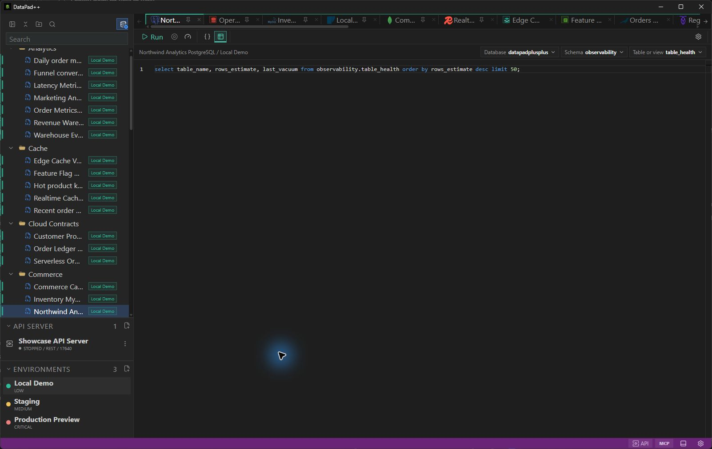
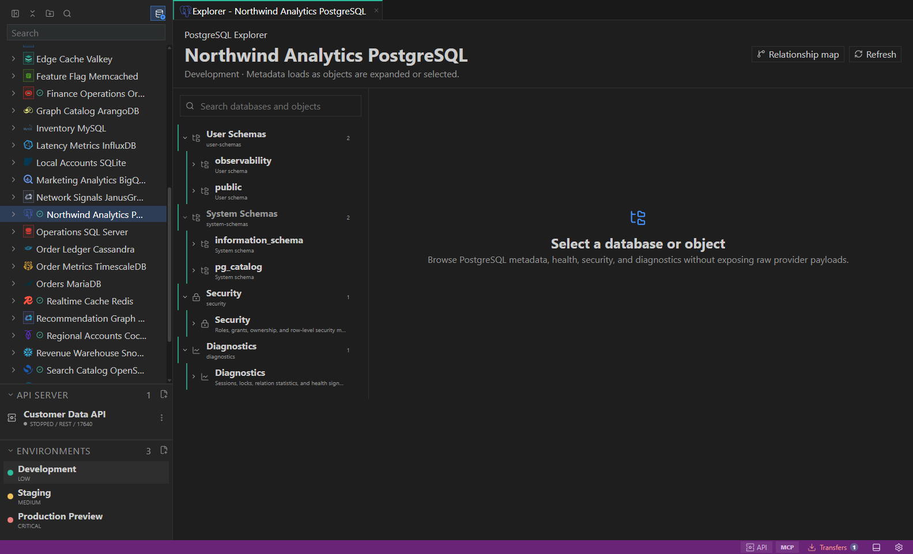
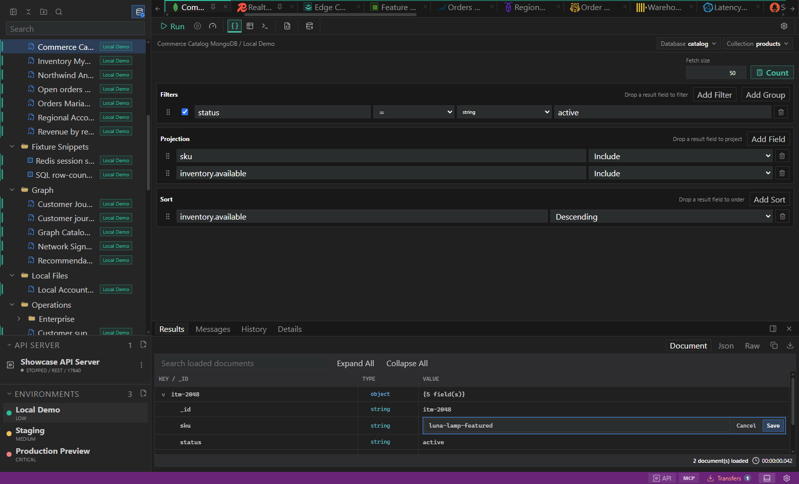
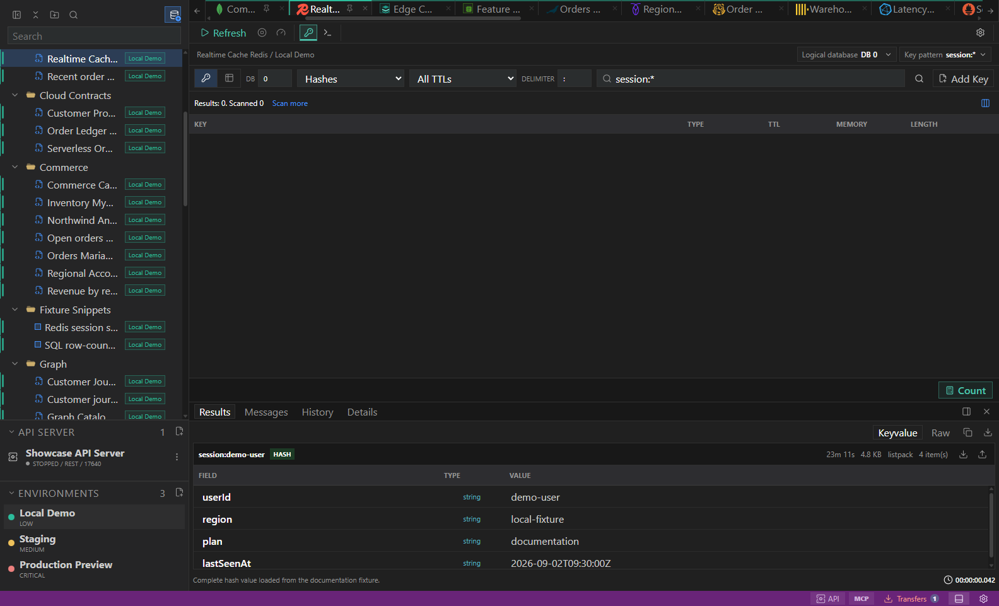
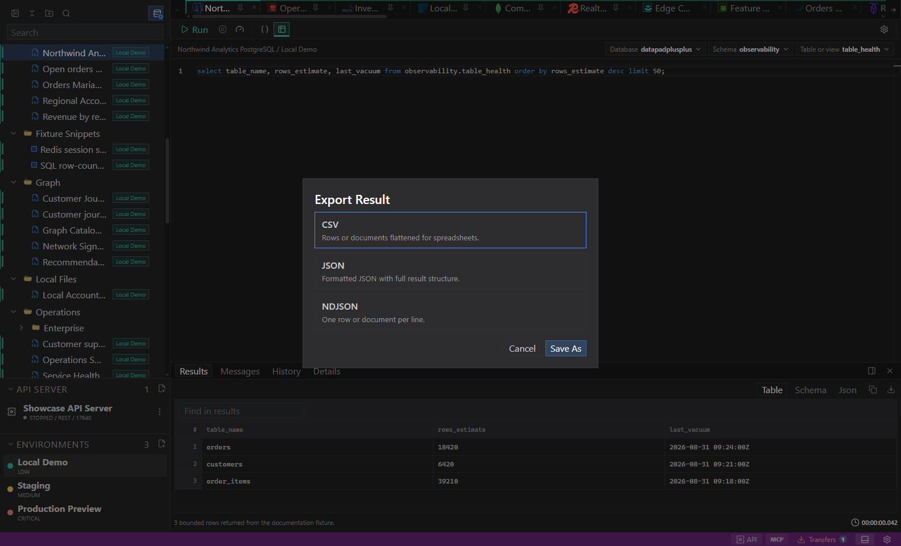
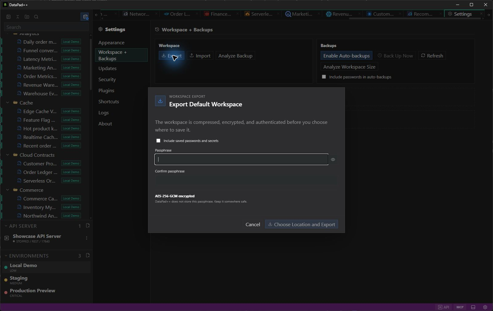

<p align="center">
  
</p>

<h1 align="center">DataPad++</h1>

<p align="center"><strong>All Data. One Pad.</strong></p>

<p align="center">
  A desktop workbench for exploring, querying, editing, testing, and moving data across different datastore families.
</p>

<p align="center">
  <a href="https://datapad-plus-plus.org/">Website</a> ·
  <a href="https://datapad-plus-plus.org/docs">Documentation</a> ·
  <a href="https://datapad-plus-plus.org/download">Downloads</a> ·
  <a href="https://github.com/FullMontyDevelopment/DataPadPlusPlus/wiki">Wiki</a>
</p>

<p align="center">
  <a href="https://github.com/FullMontyDevelopment/DataPadPlusPlus/actions/workflows/ci.yml"></a>
  
  
  
</p>

> [!CAUTION]
> **DataPad++ is pre-release software and should not be used for production workloads.** Features, workspace formats, and behavior may change, and unknown defects may cause incorrect operations, service disruption, or data loss. Begin with disposable, local, or read-only systems, verify generated operations, and keep independent backups.



## Why DataPad++?

Working with several datastores often means installing several IDEs, learning several interfaces, and continually checking which server, database, schema, or environment is active. General-purpose editor extensions help with basic queries, but they rarely provide the object exploration, diagnostics, type-aware results, and safety controls expected from a dedicated datastore tool.

DataPad++ brings those workflows into one application without pretending every datastore is the same:

- keep connections, folders, saved work, environments, and open tabs together;
- explore datastore-native objects instead of one generic tree;
- use SQL editors, visual builders, document tools, key browsers, consoles, diagrams, and diagnostics where they fit;
- retain visible connection, database/schema, environment, and execution context;
- apply read-only rules, target identity checks, execution locks, and destructive confirmations consistently.

## See The Work, Not Just The Query

### Connect and explore

Organize many connections in the Library, attach visible environment context, and browse native objects. Explorer paging keeps very large catalogs usable, while metadata-backed completion helps turn discovered objects into queries.

<p align="center"></p>

### Query, build, and edit

Use raw editors or visual builders with validated numbers, dates, UUIDs, ObjectIds, JSON, nested groups, and datastore-supported array predicates. SQL tabs can carry database and schema scope outside the query text. Document results support guarded field changes and validated raw JSON editing when the adapter can prove document identity.

<p align="center"></p>

### Inspect complete results

Switch between grids, documents, trees, text, and raw payloads. Key-value workflows provide type-aware views and an external full-value inspector for formatting or copying large JSON and binary-safe values without relying on a shortened cell preview.

<p align="center"></p>

### Move data deliberately

The staged transfer workflow exposes only the formats and destinations supported by the selected datastore. Imports fail on conflicts by default, previews show safety and compatibility warnings, and background jobs remain visible in the Transfers Center. Native backup and restore appear only where an in-process driver or server API supports them.

<p align="center"></p>

### Keep workspaces recoverable

Versioned workspaces preserve drafts, saved work, environments, and layout. Encrypted exports can exclude secrets or explicitly include vault-resolved secrets. File-first imports support review, import-as-new, destructive replacement with recovery, and workspace naming. Experimental multi-window tabs can move working tabs while the main window retains the Explorer.

<p align="center"></p>

## Datastore Families

DataPad++ documents 29 engines across these families. Availability and validation depth differ by engine, platform, server version, permissions, and selected operation.

| Family | Examples |
| --- | --- |
| SQL and relational | PostgreSQL, CockroachDB, SQL Server, MySQL, MariaDB, SQLite, Oracle, TimescaleDB |
| Document and NoSQL | MongoDB, DynamoDB, Cassandra, Cosmos DB, LiteDB |
| Key-value and cache | Redis, Valkey, Memcached |
| Search | Elasticsearch, OpenSearch |
| Analytical and warehouse | DuckDB, ClickHouse, Snowflake, BigQuery |
| Time-series and metrics | InfluxDB, Prometheus, OpenTSDB |
| Graph | Neo4j, ArangoDB, JanusGraph, Neptune |

See the [datastore documentation](https://datapad-plus-plus.org/docs/datastores) for live, experimental, plan-only, and unavailable boundaries.

## Start Safely

1. Download the appropriate pre-release build from [Releases](https://github.com/FullMontyDevelopment/DataPadPlusPlus/releases).
2. Start with a local fixture, disposable database, or read-only account.
3. Create an environment that clearly identifies the target risk.
4. Test the connection, explore its objects, and begin with bounded reads.
5. Review every generated operation before enabling edits, imports, restores, or administration.

For local development:

```powershell
npm install
npm run build
npm run fixtures:up
npm run fixtures:seed
npm run desktop:dev
```

See [Getting Started](https://datapad-plus-plus.org/docs/first-launch) and the [testing strategy](docs/testing/strategy.md) before changing application or adapter code.

## Documentation

- [User documentation](https://datapad-plus-plus.org/docs)
- [Datastore coverage](https://datapad-plus-plus.org/docs/datastores)
- [Features reference](docs/features.md)
- [Workspace and backups](docs/settings-and-workspace.md)
- [Security and safety](docs/architecture/security-and-safety.md)
- [Architecture](docs/architecture/overview.md)
- [Contributing](docs/contributing/development.md)

## License

DataPad++ is source-available under the repository [license](LICENSE). Review it before redistribution or commercial use.
